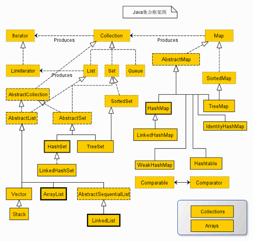
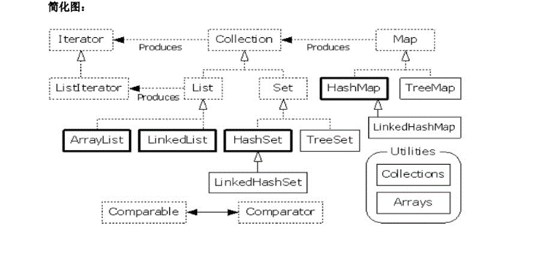
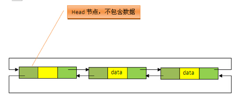
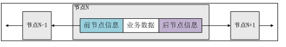
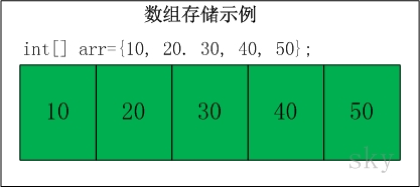
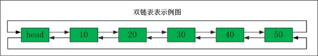
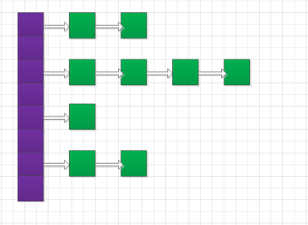

## 义码当仙之集合框架

|Java集合框架图|Java集合框架简化图|
|:----|:----|
|| |

说明：对于以上的框架图有如下几点说明  
1. 所有集合类都位于java.util包下。Java的集合类主要由两个接口派生而出：Collection和Map，Collection和Map是Java集合框架的根接口，这两个接口又包含了一些子接口或实现类。  
2. 集合接口：6个接口（短虚线表示），表示不同集合类型，是集合框架的基础。  
3. 抽象类：5个抽象类（长虚线表示），对集合接口的部分实现。可扩展为自定义集合类。  
4. 实现类：8个实现类（实线表示），对接口的具体实现。  
5. Collection 接口是一组允许重复的对象。  
6. Set 接口继承 Collection，集合元素不重复。  
7. List 接口继承 Collection，允许重复，维护元素插入顺序。  
8. Map接口是键－值对象，与Collection接口没有什么关系。  
9. Set、List和Map可以看做集合的三大类：  
- List集合：是有序集合，集合中的元素可以重复，访问集合中的元素可以根据元素的索引来访问。  
- Set集合：是无序集合，集合中的元素不可以重复，访问集合中的元素只能根据元素本身来访问（也是集合里元素不允许重复的原因）。  
- Map集合：保存Key-value对形式的元素，访问时只能根据每项元素的key来访问其value。  

<hr>

### Java运算符

|运算符|说明|
|:----|:----|
|<<|左移运算符，num << 1，相当于num乘以2|
|\>>|右移运算符，num >> 1，相当于num除以2|
|\>>>|无符号右移，忽略符号位，空位都以0补齐|

<hr>

### 数组拷贝
Arrays.copyOf 功能是实现数组的复制，返回复制后的数组。参数是被复制的数组和复制的长度  
System.arraycopy 方法：如果是数组比较大，那么使用System.arraycopy会比较有优势，因为其使用的是内存复制，省去了大量的数组寻址访问等时间  
复制指定源数组src到目标数组dest。复制从src的srcPos索引开始，复制的个数是length，复制到dest的索引从destPos开始。  

src:源数组；	 
srcPos:源数组要复制的起始位置；  
dest:目的数组；  
destPos:目的数组放置的起始位置；  
length:复制的长度。  

注意：src and dest都必须是同类型或者可以进行转换类型的数组。  

有趣的是这个函数可以实现自己到自己复制，比如：
```java
int[] fun = {0,1,2,3,4,5,6}; 
System.arraycopy(fun,0,fun,3,3);
```
则结果为：{0,1,2,0,1,2,6};  

实现过程：先生成一个长度为length的临时数组，将fun数组中srcPos到srcPos+length-1之间的数据拷贝到临时数组中，再执行System.arraycopy(临时数组,0,fun,3,3)。  

<hr>

### 手写List框架  
List集合代表一个有序集合，集合中每个元素都有其对应的顺序索引。List集合允许使用重复元素，可以通过索引来访问指定位置的集合元素。  

List接口继承于Collection接口，它可以定义一个允许重复的有序集合。因为List中的元素是有序的，所以我们可以通过使用索引（元素在List中的位置，类似于数组下标）来访问List中的元素，这类似于Java的数组。  

List接口为Collection直接接口。List所代表的是有序的Collection，即它用某种特定的插入顺序来维护元素顺序。用户可以对列表中每个元素的插入位置进行精确地控制，同时可以根据元素的整数索引（在列表中的位置）访问元素，并搜索列表中的元素。实现List接口的集合主要有：ArrayList、LinkedList、Vector、Stack。  

#### ArrayList底层实现原理

> 示例项目：ymdx-collection -> collection-arraylist  

- Arraylist底层基于数组实现  
```java
transient Object[] elementData;
```

- Arraylist底层默认数组初始化大小为10个object数组  
```java
/**
 * Default initial capacity.
 */
private static final int DEFAULT_CAPACITY = 10;

/**
 * Constructs an empty list with the specified initial capacity.
 *
 * @param  initialCapacity  the initial capacity of the list
 * @throws IllegalArgumentException if the specified initial capacity is negative
 */
public ArrayList(int initialCapacity) {
    if (initialCapacity > 0) {
        this.elementData = new Object[initialCapacity];
    } else if (initialCapacity == 0) {
        this.elementData = EMPTY_ELEMENTDATA;
    } else {
        throw new IllegalArgumentException("Illegal Capacity: " + initialCapacity);
    }
}
```

#### Vector底层实现原理
Vector是线程安全的，但是性能比ArrayList要低。  
ArrayList，Vector主要区别为以下几点：   
1. Vector是线程安全的，源码中有很多的synchronized可以看出，而ArrayList不是。导致Vector效率无法和ArrayList相比；  
2. ArrayList和Vector都采用线性连续存储空间，当存储空间不足的时候，ArrayList默认增加为原来的50%，Vector默认增加为原来的一倍；  
3. Vector可以设置capacityIncrement，而ArrayList不可以，从字面理解就是capacity容量，Increment增加，容量增长的参数。  

<hr>

### LinkedList  

> 示例项目：ymdx-collection -> collection-linkedlist  

#### LinedList原理  
LinkedList 和 ArrayList 一样，都实现了 List 接口，但其内部的数据结构有本质的不同。LinkedList 是基于链表实现的（通过名字也能区分开来），所以它的插入和删除操作比 ArrayList 更加高效。但也是由于其为基于链表的，所以随机访问的效率要比 ArrayList 差。  

#### LinkedList数据结构原理
LinkedList底层的数据结构是基于双向循环链表的，且头结点中不存放数据，如下：  

  

既然是双向链表，那么必定存在一种数据结构——我们可以称之为节点，节点实例保存业务数据，前一个节点的位置信息和后一个节点位置信息，如下图所示： 
 

  

#### 数组和链表结构对比

  

数组：是将元素在内存中连续存放，由于每个元素占用内存相同，可以通过下标迅速访问数组中任何元素。但是如果要在数组中增加一个元素，需要移动大量元素，在内存中空出一个元素的空间，然后将要增加的元素放在其中。
同样的道理，如果想删除一个元素，同样需要移动大量元素去填掉被移动的元素。如果应用需要快速访问数据，很少插入和删除元素，就应该用数组。  

  

链表：中的元素在内存中不是顺序存储的，而是通过存在元素中的指针联系到一起，每个结点包括两个部分：一个是存储数据元素的数据域，另一个是存储下一个结点地址的指针。  
如果要访问链表中一个元素，需要从第一个元素开始，一直找到需要的元素位置。但是增加和删除一个元素对于链表数据结构就非常简单了，只要修改元素中的指针就可以了。如果应用需要经常插入和删除元素你就需要用链表。  

#### 内存存储区别
数组从栈中分配空间, 对于程序员方便快速，但自由度小。  
链表从堆中分配空间, 自由度大但申请管理比较麻烦。  

#### 逻辑结构区别
数组必须事先定义固定的长度（元素个数），不能适应数据动态地增减的情况。当数据增加时，可能超出原先定义的元素个数；当数据减少时，造成内存浪费。　
链表动态地进行存储分配，可以适应数据动态地增减的情况，且可以方便地插入、删除数据项。（数组中插入、删除数据项时，需要移动其它数据项）　

#### 总结  
1. 存取方式上，数组可以顺序存取或者随机存取，而链表只能顺序存取；　 
2. 存储位置上，数组逻辑上相邻的元素在物理存储位置上也相邻，而链表不一定；　 
3. 存储空间上，链表由于带有指针域，存储密度不如数组大；　 
4. 按序号查找时，数组可以随机访问，时间复杂度为O(1)，而链表不支持随机访问，平均需要O(n)；　 
5. 按值查找时，若数组无序，数组和链表时间复杂度均为O(1)，但是当数组有序时，可以采用折半查找将时间复杂度降为O(logn)；　 
6. 插入和删除时，数组平均需要移动n/2个元素，而链表只需修改指针即可；　 
7. 空间分配方面：  
数组在静态存储分配情形下，存储元素数量受限制，动态存储分配情形下，虽然存储空间可以扩充，但需要移动大量元素，导致操作效率降低，而且如果内存中没有更大块连续存储空间将导致分配失败；  
链表存储的节点空间只在需要的时候申请分配，只要内存中有空间就可以分配，操作比较灵活高效；  

<hr>  

### 手写Map框架  

#### 底层结构  
HashMap的底层结构是由数组+链表构成的。  

  

数组（紫色）：hash数组（桶），数组元素是每个链表的头节点；  
链表（绿色）：解决hash冲突，不同的key映射到了数组的同一索引处，则形成链表。  

#### put和get方法
put()方法大概过程如下：  
如果添加的key值为null，那么将该键值对添加到数组索引为0的链表中，不一定是链表的首节点。  
如果添加的key不为null，则根据key计算数组索引的位置：  
数组索引处存在链表，则遍历该链表，如果发现key已经存在，那么将新的value值替换旧的value值  
数组索引处不存在链表，将该key-value添加到此处，成为头节点  
get()方法的大概过程：  
1. 如果key为null，那么在数组索引table[0]处的链表中遍历查找key为null的value   

2. 如果key不为null，根据key找到数组索引位置处的链表，遍历查找key的value，找到返回value，若没找到则返回null   

#### 扩容机制

先看一个例子，创建一个HashMap，初始容量默认为16，负载因子默认为0.75，那么什么时候它会扩容呢？  
来看以下公式：  
```text
实际容量 = 初始容量 × 负载因子
```
计算可知，16×0.75=12，也就是当实际容量超过12时，这个HashMap就会扩容。  

- 初始容量  
当构造一个hashmap时，初始容量设为不小于指定容量的2的次方的一个数（new HashMap(5)， 指定容量为5，那么实际初始容量为8，2^3=8>5），且最大值不能超过2的30次方。  

- 负载因子  
负载因子是哈希数组在其容量自动增加之前可以达到多满的一种尺度。（时间与空间的折衷） 当哈希数组中的条目数超出了加载因子与初始容量的乘积时，则要对该哈希数组进行扩容操作（即resize）。   

特点：  
负载因子越小，容易扩容，浪费空间，但查找效率高  
负载因子越大，不易扩容，对空间的利用更加充分，查找效率低（链表拉长）  

- 扩容过程  
HashMap在扩容时，新数组的容量将是原来的2倍，由于容量发生变化，原有的每个元素需要重新计算数组索引Index，再存放到新数组中去，这就是所谓的rehash。  

- equals方法和hashCode方法  

1. 如果两个对象相同，那么它们的hashCode值一定要相同。也告诉我们重写equals方法，一定要重写hashCode方法，也就是说hashCode值要和类中的成员变量挂上钩，对象相同，成员变量相同，hashCode值一定相同。  
2. 如果两个对象的hashCode相同，它们并不一定相同，这里的对象相同指的是用equals方法比较。  

#### 基于ArrayList实现Map  
> 示例代码：ymdx-collection -> collection-hashmap -> com.ymdx.map.ext.my.ExtArrayListMap.java  

#### 基于LinkedList实现Map  
> 示例代码：ymdx-collection -> collection-hashmap -> com.ymdx.map.ext.my.ExtLinkedListMap.java  

#### 基于JDK1.7版本实现HashMap  

#### HashMap 核心源码部分的分析  
1. HashMap只允许一个为null的key  
2. HashMap的扩容：当前table数组的两倍  
3. HashMap实际能存储的元素个数：capacity * loadFactor  
4. HashMap在扩容的时候，会重新计算hash值，并对hash的位置进行重新排列，因此，为了效率，尽量给HashMap指定合适的容量，避免多次扩容  

<hr>


